# Netflix Content Analysis Pipeline with Apache Airflow & PySpark

**Author:** Vihaan Manchanda  
**Course:** IDS 706 - Data Engineering  
**Institution:** Duke University, Master's in Data Science 
**Semester:** Fall 2025

---

## 📑 Table of Contents

1. [Project Overview](#project-overview)
2. [Screenshots](#screenshots)
3. [Project Structure](#project-structure)
4. [Key Features](#key-features)
5. [Setup & Installation](#setup--installation)
   - [Prerequisites](#prerequisites)
   - [Step-by-Step Installation](#step-by-step-installation)
6. [Dataset](#dataset)
7. [Architecture](#architecture)
   - [System Components](#system-components)
   - [Technology Stack](#technology-stack)
8. [Pipeline 1: Netflix Data Pipeline (Core)](#-pipeline-1-netflix-data-pipeline-core)
   - [Task Breakdown](#task-breakdown)
   - [Task Dependencies](#task-dependencies)
9. [Pipeline 2: PySpark Integration (BONUS)](#-pipeline-2-pyspark-integration-bonus---15)
   - [Task Breakdown](#task-breakdown-1)
   - [PySpark Advantages](#pyspark-advantages-demonstrated)
10. [Analysis Results](#-analysis-results)
11. [Key Technical Concepts](#-key-technical-concepts)
12. [Troubleshooting](#-troubleshooting)
13. [Learning Outcomes](#-learning-outcomes)
14. [Future Enhancements](#-future-enhancements)
15. [References & Resources](#-references--resources)
16. [Author](#-author)

---

## Project Overview

A production-grade ETL pipeline built with Apache Airflow that orchestrates the ingestion, transformation, and analysis of Netflix content data. The project demonstrates advanced data engineering concepts including parallel processing, distributed computing with PySpark, workflow orchestration, and automated data quality management.

---

## Screenshots

### 1. Basic Pipeline Success
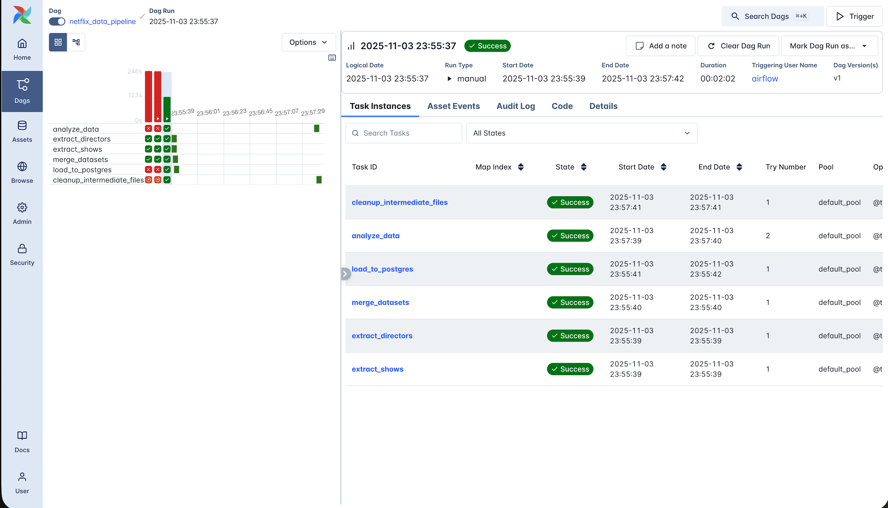
*All tasks completed successfully with proper dependency management*

### 2. Basic Pipeline DAG Graph View
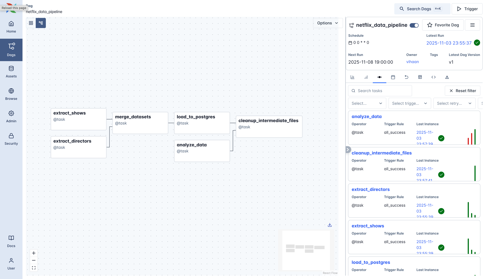
*Visual representation showing parallel execution of extract tasks*

### 3. Analysis Visualization

*Four-panel Netflix content analysis dashboard*

### 4. PySpark Pipeline Success
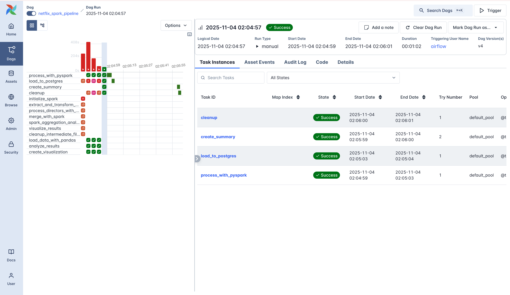
*Distributed processing pipeline with Spark integration*

### 5. PySpark Pipeline DAG Graph View
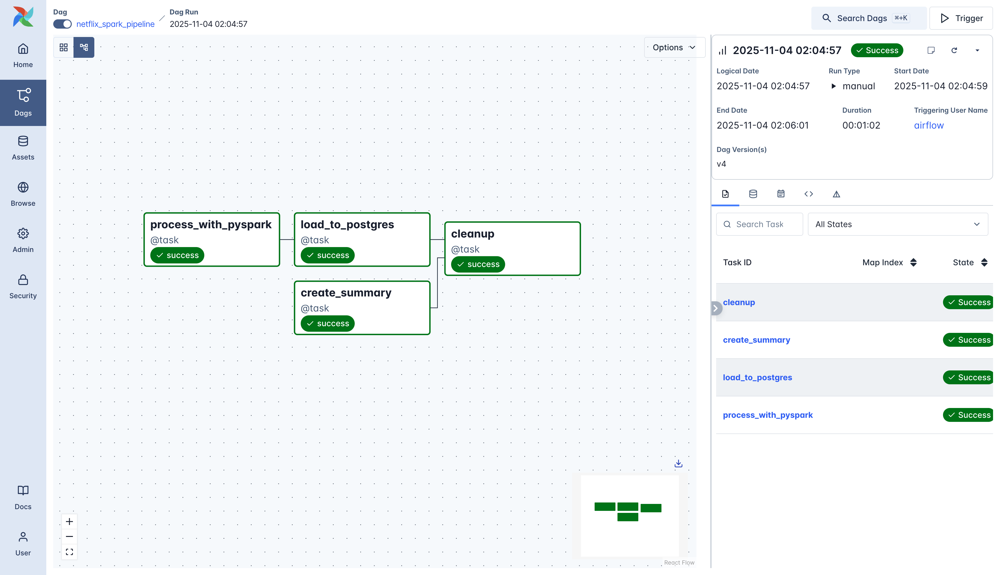
*Visual representation showing parallel execution of PySpark tasks*

---

## 📁 Project Structure

```
airflow-netflix/
│
├── .devcontainer/
│   ├── docker-compose.yml        # Docker services orchestration
│   ├── .Dockerfile                # Airflow image with Java & dependencies
│   └── db.env                     # PostgreSQL credentials
│
├── dags/
│   ├── netflix_pipeline.py        # Core ETL pipeline DAG
│   └── netflix_pipeline_spark.py  # PySpark integration DAG
│
├── data/
│   ├── raw/
│   │   └── netflix_titles.csv     # Source dataset (not in git)
│   └── processed/                 # Generated outputs (temporary)
│       ├── *.csv                  # Intermediate data files
│       └── *.png                  # Analysis visualizations
│
├── logs/                          # Airflow execution logs
│   └── dag_id=*/                  # Organized by DAG
│
├── plugins/                       # Custom Airflow plugins (if any)
│
├── config/                        # Airflow configuration
│   └── airflow.cfg               # Generated at runtime
│
├── requirements.txt               # Python dependencies
│
├── .gitignore                    # Git exclusions
│
├── README.md                     # This file
│
└── results_screenshots/           # Documentation screenshots
    ├── basi_all_pass.png
    ├── basic_graph.png
    ├── pyspark_all_pass.png
    ├── pyspark_graph.png
    └── netflix_analysis.png
```

### Key Features

-  **Dual Pipeline Architecture**: Traditional ETL + PySpark distributed processing
-  **Parallel Task Execution**: Optimized for performance with concurrent data ingestion
-  **Distributed Computing**: Apache Spark integration for scalable data processing
-  **Automated Scheduling**: Weekly cron-based execution
-  **Data Quality**: Comprehensive validation and cleaning
-  **Production-Ready**: Containerized deployment with Docker
-  **Database Integration**: PostgreSQL for persistent storage
-  **Visualization**: Automated analysis charts generation

---

## Setup & Installation

### Prerequisites

- **Docker Desktop** (latest version)
- **Python 3.8+** (for local development)
- **8GB RAM minimum** (16GB recommended)
- **10GB free disk space**
- **Kaggle account** (for dataset download)

### Step-by-Step Installation

#### 1. Clone Repository

```bash
git clone https://github.com/yourusername/airflow-netflix-pipeline.git
cd airflow-netflix-pipeline
```

#### 2. Download Dataset

1. Visit [Netflix Dataset on Kaggle](https://www.kaggle.com/datasets/shivamb/netflix-shows)
2. Download `netflix_titles.csv`
3. Place in `data/raw/netflix_titles.csv`

```bash
# Verify file is in correct location
ls -lh data/raw/netflix_titles.csv
```

#### 3. Build Docker Containers

```bash
cd .devcontainer

# Build images (takes 5-10 minutes)
docker compose build --no-cache

# Start all services
docker compose up -d

# Verify containers are running
docker compose ps
```

Expected output:
```
NAME                                    STATUS
devcontainer-airflow-apiserver-1        healthy
devcontainer-airflow-scheduler-1        healthy
devcontainer-airflow-worker-1           healthy
devcontainer-db-1                       healthy
devcontainer-redis-1                    healthy
```

#### 4. Access Airflow Web UI

1. Open browser: **http://localhost:8080**
2. Login credentials:
   - **Username**: `airflow`
   - **Password**: `airflow`

#### 5. Configure Database Connection

1. Navigate to **Admin → Connections**
2. Click **+ (Add Connection)**
3. Fill in details:

| Field | Value |
|-------|-------|
| Connection ID | `Postgres` |
| Connection Type | `Postgres` |
| Host | `db` |
| Database | `airflow_db` |
| Login | `vscode` |
| Password | `vscode` |
| Port | `5432` |

4. Click **Save**

#### 6. Activate & Run DAGs

**For Core Pipeline:**
1. Find `netflix_data_pipeline` in DAG list
2. Toggle switch to **ON** (blue/green)
3. Click **▶️ Trigger DAG** button
4. Monitor execution in Grid/Graph view

**For PySpark Pipeline (Bonus):**
1. Find `netflix_spark_pipeline`
2. Toggle **ON**
3. Click **▶️ Trigger DAG**

---

## Dataset

**Source:** [Netflix Shows Dataset on Kaggle](https://www.kaggle.com/datasets/shivamb/netflix-shows)

**Content:**
- **Size**: ~8,800 titles (movies and TV shows)
- **Format**: CSV with comprehensive metadata
- **Attributes**: show_id, type, title, director, cast, country, release_year, rating, duration, genres, description

**Data Split Strategy:**
- **Table 1**: Shows metadata (title, type, rating, year)
- **Table 2**: Directors (handling multiple directors per show)
- **Merged**: Complete dataset with relational integrity

---

## Architecture

### System Components

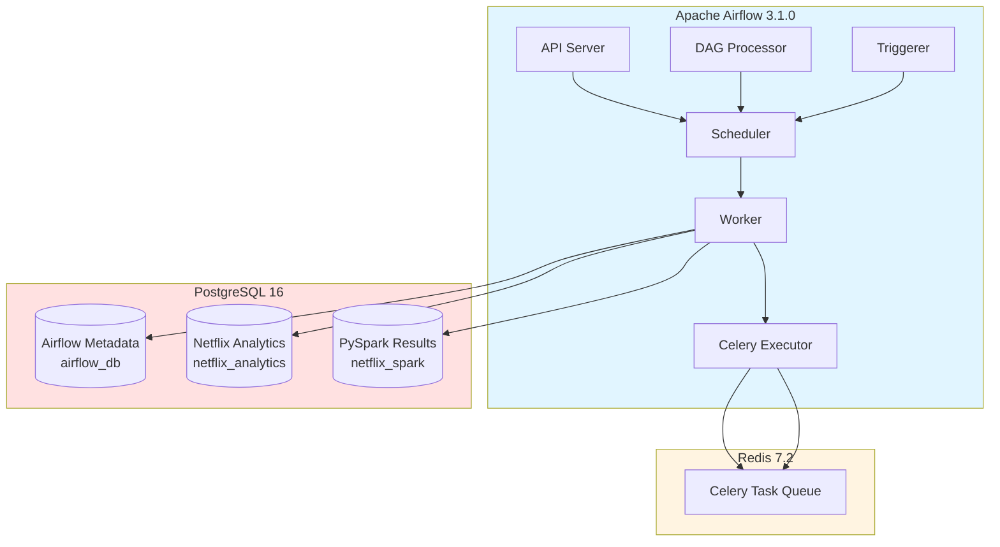

### Technology Stack

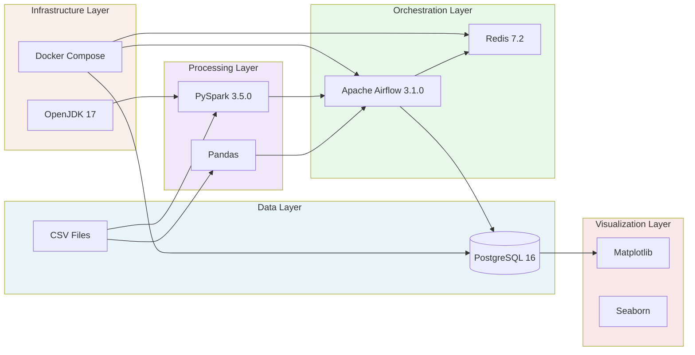

| Component | Technology | Version |
|-----------|-----------|---------|
| **Orchestration** | Apache Airflow | 3.1.0 |
| **Database** | PostgreSQL | 16 |
| **Message Broker** | Redis | 7.2 |
| **Distributed Processing** | Apache Spark (PySpark) | 3.5.0 |
| **Data Processing** | Pandas | Latest |
| **Visualization** | Matplotlib, Seaborn | Latest |
| **Containerization** | Docker & Docker Compose | Latest |
| **Programming** | Python | 3.12 |
| **Java Runtime** | OpenJDK | 17 |

---

## 🔄 Pipeline 1: Netflix Data Pipeline (Core)

### DAG: `netflix_data_pipeline`

**Schedule:** Weekly execution (`@weekly` - every Monday at midnight)  
**Start Date:** November 1, 2025  
**Catchup:** Disabled

### Task Breakdown

#### 1️⃣ **extract_shows**
```python
Purpose: Ingest and clean show metadata
Operations:
  - Read raw Netflix CSV
  - Remove null show_id/title entries
  - Validate release years (> 1900)
  - Fill missing ratings and genres
  - Select core columns
Output: shows_clean.csv (8,807 records)
```

#### 2️⃣ **extract_directors**
```python
Purpose: Process director information
Operations:
  - Extract director data
  - Handle multiple directors per show (split by comma)
  - Create director-show relationships
  - Remove duplicates
Output: directors_clean.csv (~5,000 relationships)
```

**⚡ Parallel Execution**: Tasks 1 & 2 run simultaneously

#### 3️⃣ **merge_datasets**
```python
Purpose: Join shows with directors
Operations:
  - Left join on show_id
  - Handle missing directors (fill with "Unknown Director")
  - Remove duplicate columns
  - Validate data integrity
Output: netflix_merged.csv (complete dataset)
```

#### 4️⃣ **load_to_postgres**
```python
Purpose: Persist to database
Database: PostgreSQL
Schema: netflix_analytics
Table: shows
Operations:
  - Create schema if not exists
  - Drop and recreate table (idempotent)
  - Batch insert with conflict handling
  - Transaction management with rollback
Result: 8,807 records loaded
```

#### 5️⃣ **analyze_data**
```python
Purpose: Generate insights and visualizations
Operations:
  - Query data from PostgreSQL
  - Perform aggregations:
    * Content type distribution
    * Top 10 directors by show count
    * Release trends (2010-present)
    * Content rating distribution
  - Create 4-panel visualization
Output: netflix_analysis.png
```

#### 6️⃣ **cleanup_intermediate_files**
```python
Purpose: Clean up temporary files
Operations:
  - Remove intermediate CSV files
  - Keep only final visualization
  - Free up storage space
Trigger: After both load and analysis complete
```

### Task Dependencies

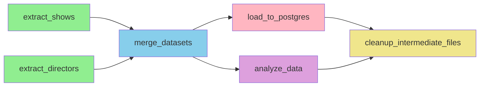

### Key Features

 **Parallel Processing**: Extract tasks run concurrently  
 **XCom for Coordination**: Only file paths shared (not data)  
 **Idempotent Tasks**: Safe to re-run  
 **Error Handling**: Automatic retries (2 attempts, 2-min delay)  
 **Data Quality**: Validation at every stage  

---

## 🚀 Pipeline 2: PySpark Integration (BONUS - 15%)

### DAG: `netflix_spark_pipeline`

**Schedule:** Weekly (`@weekly`)  
**Purpose:** Demonstrate distributed processing capabilities

### Task Breakdown

#### 1️⃣ **process_with_pyspark**
```python
PySpark Operations:
  - Initialize SparkSession (local[1] mode)
  - Read CSV with Spark DataFrames
  - GroupBy aggregations (content type counts)
  - Filter operations (movies vs TV shows)
  - Column transformations (trim, cast, alias)
  - Null handling with fillna
  - Convert to Pandas and save
  
Spark Configuration:
  - Master: local[1]
  - Driver Memory: 1GB
  - Shuffle Partitions: 2
  - UI: Disabled (headless mode)

Output: netflix_spark_processed.csv
```

#### 2️⃣ **load_to_postgres**
```python
Purpose: Load Spark-processed data
Schema: netflix_spark
Table: shows
Columns: show_id, type, title, release_year, rating, director
Records: 8,807
```

#### 3️⃣ **create_summary**
```python
Purpose: Query and summarize results
Operations:
  - SQL query with GROUP BY
  - Aggregate by content type
  - Calculate totals
  - Display PySpark processing confirmation
```

#### 4️⃣ **cleanup**
```python
Purpose: Finalize pipeline
Operations:
  - Log completion
  - Clean temporary files
```

### Task Dependencies

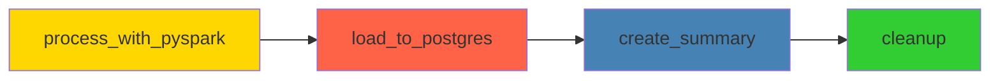

### PySpark Advantages Demonstrated

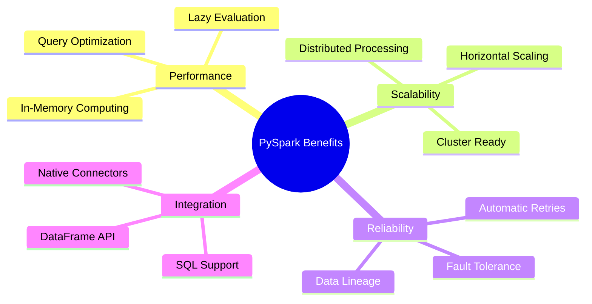

| Feature | Benefit |
|---------|---------|
| **Lazy Evaluation** | Optimized query execution plans |
| **In-Memory Computing** | Faster than disk-based processing |
| **Distributed Processing** | Horizontal scalability |
| **Fault Tolerance** | Automatic retry on failures |
| **SQL Integration** | Familiar syntax for data analysts |

---

##  Analysis Results

### Key Insights from Netflix Dataset

**Content Distribution:**
- **Movies**: 69.6% (6,131 titles)
- **TV Shows**: 30.4% (2,676 titles)

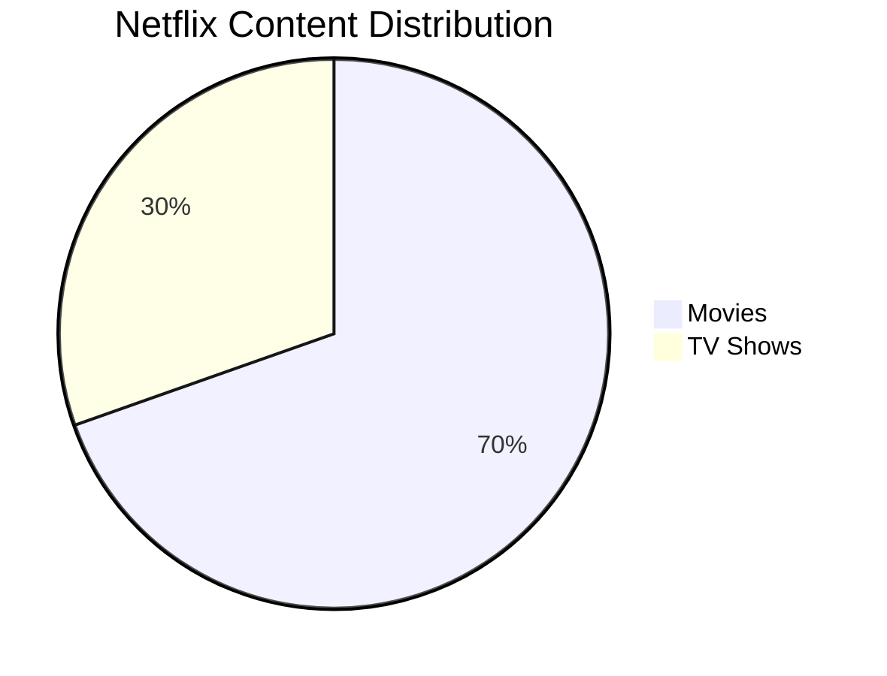

**Top 10 Most Prolific Directors:**
1. Rajiv Chilaka - 22 shows
2. Raúl Campos - 18 shows
3. Marcus Raboy - 16 shows
4. Suhas Kadav - 16 shows
5. Jay Karas - 15 shows
6. Cathy Garcia-Molina - 13 shows
7. Martin Scorsese - 12 shows
8. Jay Chapman - 12 shows
9. Youssef Chahine - 11 shows
10. Steven Spielberg - 11 shows

**Content Release Trends:**
- Peak year: **2018** (1,147 titles added)
- Significant growth from 2015-2019
- Decline after 2019 (possible due to dataset cutoff)

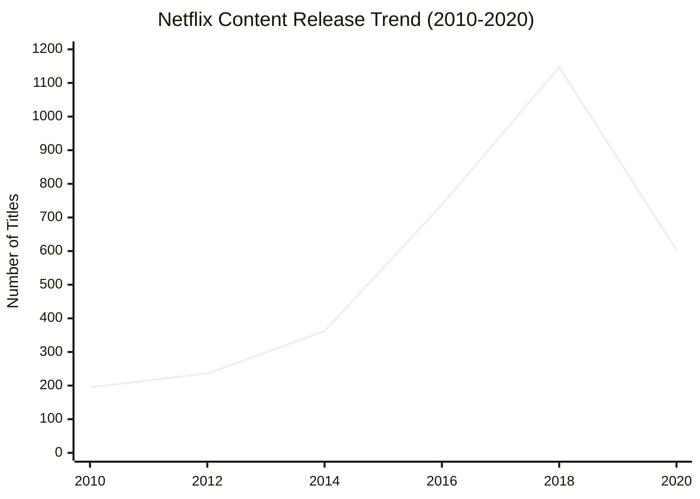

**Most Common Ratings:**
- TV-MA: 3,207 titles
- TV-14: 2,160 titles
- TV-PG: 863 titles

**Geographic Distribution:**
- Top producing country: United States
- Strong international content (India, UK, South Korea)
